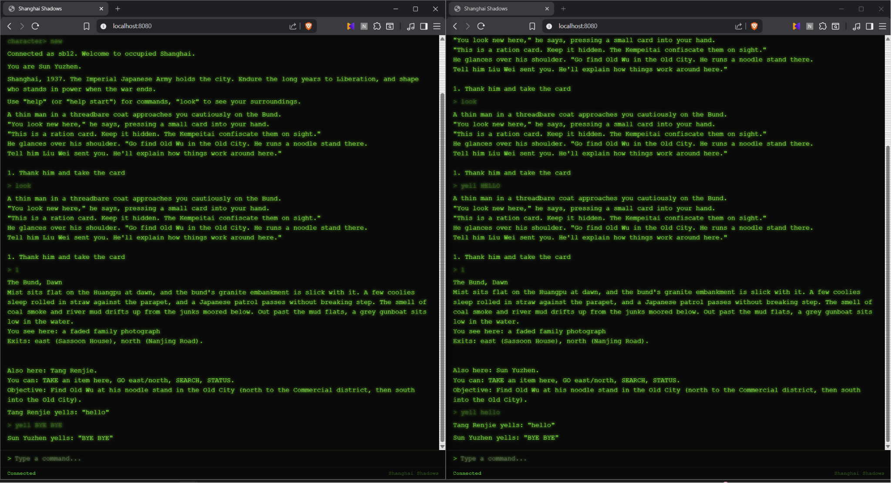
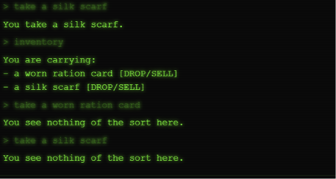
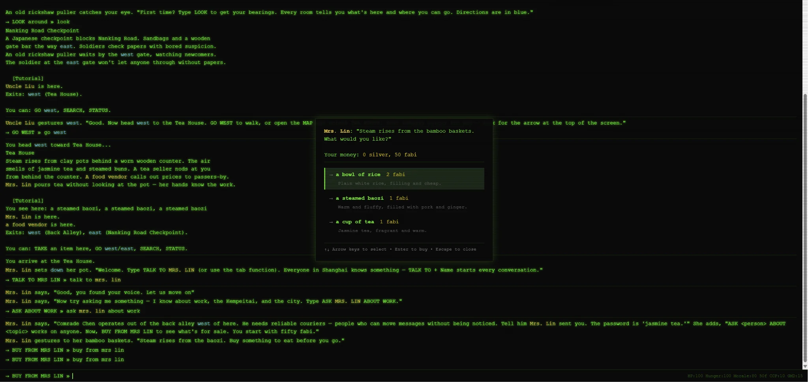
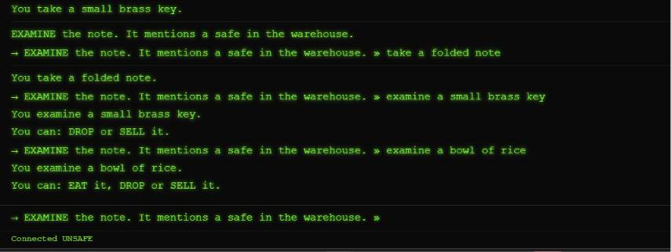
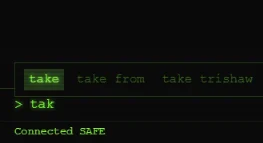
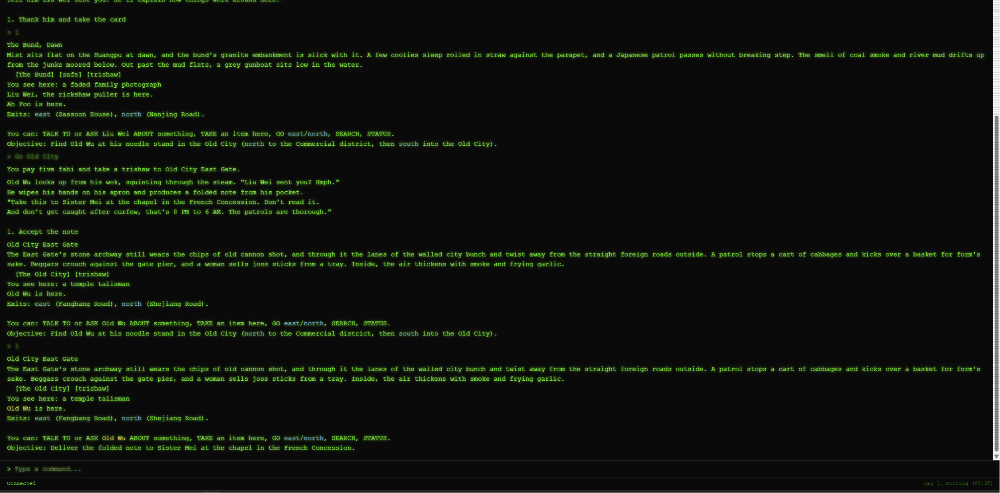
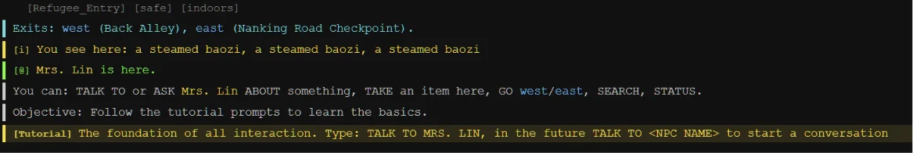
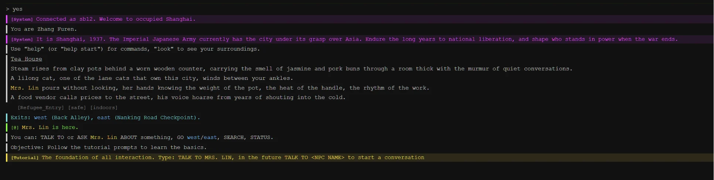
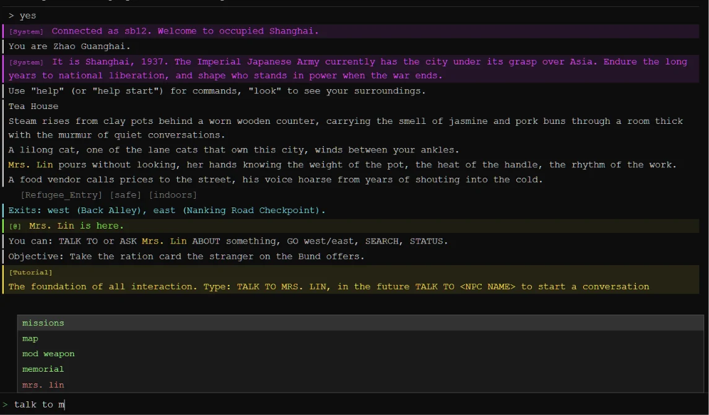
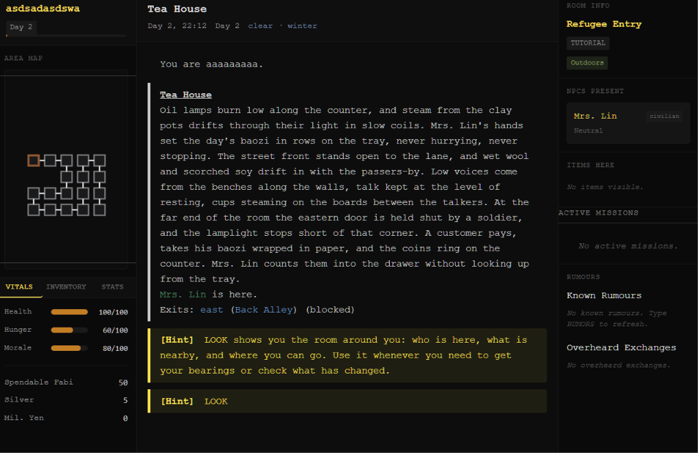

# Shanghai Shadows

> A multiplayer text story based MUD set in Japanese-occupied Shanghai, built as a passion project to help teenagers in Shanghai learn what ordinary people lived through during the occupation.


**Play Shanghai Shadows:** <https://shanghai.dino.icu/login>

Shanghai Shadows runs in a browser on Hack Club DNS and a Nest VPS. You do not play a soldier, spy, or chosen hero. You play one resident of an occupied city, trying to eat, stay alive, and keep your name out of patrol reports between November 1937 and the Day 180 liberation endpoint. Other players share the same clock, weather, rumours, faction fortunes, and consequences. 

## Quick Start

```bash
git clone <repository-url>
cd SSL
python -m pip install -r requirements.txt
python main.py
```

Open `http://127.0.0.1:8080` and create an account. Python 3.11+ is required. On Windows, `start.bat` does the same thing and is the easiest way to run it.

The live version is at <https://shanghai.dino.icu/login>.

## What It Is

The game is built around the idea of laobaixing, ordinary people, rather than heroes or villains. Most people who lived through occupied Shanghai were not collaborators, resistance legends, or rambo style protagonists. They queued for rice, listened for patrols, traded through dangerous channels, kept family secrets, and made small choices that could cost them.

The MUD follows that view mechanically.

- With a single city clock, weather system, rumor network, and set of faction outcomes, the world is shared and enduring.
- Death is irreversible. The next character in the account inherits only what was left behind and is able to retrieve the previous character's journal, but a dead character remains dead.
- Day 180 marks the end of the campaign. The impact that players created throughout the city determines which liberation ending takes place.
- Violence does occur, but it is typically an error. Bloodshed is costly due to the Kempeitai, informants, witnesses, rumors, and wanted system.

## What You Can Do ATM

- Manage hunger, morale, health, inventory space, seasonal food pressure, and three currencies: fabi, silver yuan, and Japanese military yen with each having its own 
- Build trust across seven factions, where helping one side can damage another relationship.
- Hear rumours pass through NPC conversations, then read the city's daily version in a newspaper.
- Move through curfew hours, patrol routes, checkpoints, restricted districts, disguises, wanted levels, and tailing checks.
- Search, buy, wear, follow, yell, hide, plant evidence, pick pockets, ask NPCs about leads, and share food to bond with people.
- Learn the core systems through a staged tutorial with Mrs. Lin, using the same sound, tailing, disguise, rumour, and room mechanics as the live world.

## Why I Made ShanghaiShadows

I discovered [ForlornMUD](https://github.com/Snxhit/ForlornMUD) during Hack Club's Flavortown hackathon, which was the first spark. It demonstrated to me that a text world could function as a complete game without a big art pipeline; rooms, rules, writing, and perseverance were sufficient. The more conventional RPG loop used in ForlornMUD was explore, fight, loot, acquire XP, upgrade, and repeat.

I was hoping for a different response to the question, "What does the player do?" My grandparents' tales of hunger, curfews, ration cards, informers, and faction politics from Zhejiang, a short distance from Shanghai, made survival seem more genuine than battle, which at the time would have been extremely difficult and hence historically inaccurate. After then, Shanghai Shadows turned into a MUD about civilian pressure, emphasizing trade-offs, evasion, bargaining, and the risk of being recognized.


## How The Game Works

### Survival And Economy

You have health, hunger, and morale. Hunger drains over time and hits harder in winter. Famished characters perform worse at stealth because starvation should affect how a person moves and looks. Low morale weakens fighting, hiding, and vendor prices.

Money comes in fabi, silver yuan, and military yen. Fabi inflates over the campaign, silver holds value, and military yen inflate fastest. Prices combine district, faction attitude, market state, inflation, season, trust, and morale, so the same food can cost different amounts in different neighbourhoods. Winter raises food prices and slows restocking. When ordinary vendors shut you out, the black market still sells at a markup, with contraband risk at checkpoints.

Food has social significance as well. Food has cultural connotations, and eating together can foster camaraderie. The wrong food given to the wrong person can cost trust instead such as giving Japanese food to a Chinese person or vice versa.

### People, Trust, And Rumours

Every NPC belongs to a faction, and the player holds separate trust by faction and role. Trust starts neutral at 50. Helping the resistance, for example, may help CCP standing while hurting Kempeitai standing. At 70+, factions grant concrete perks such as safehouse rooms, weapon repair, checkpoint passage, or faster criminal-record clearing.

The conversation of NPCs varies with memory. Someone who likes you will welcome you differently than someone who witnessed your murder or heard a negative rumor. Topics, room knowledge, leads, local repercussions, and sources of rumors are all revealed by ASK. BOND fosters friendship, usually over food.

Rumors are unchangeable recordings that change as NPCs recite them. After a certain number of hops, the story becomes jumbled as names change, numbers increase, and meaning can reverse. The same event is recounted by factions using their own language and common terms. A unpleasant afternoon can turn into tomorrow's newspaper since player crimes enter the same web.

### Testimonies/documents

Readable witness materials have mechanical weight and are based on research notes. Unit 731, comfort women, Nanjing survivors, POW records, and propaganda are examples of happenings that might lower morale, change faction trust, open tasks, or unlock contacts. 

### NPC-To-NPC Interaction

The city should talk even when the player is not the subject. NPC interactions use three categories.

- **Ambient** exchanges are autonomous conversations that nearby players overhear.
- **Persistent** exchanges leave bounded aftermath, such as a shuttered stall, cautious dialogue, or price pressure.
- **Actionable** exchanges can later become an ASK lead or storylet if actors, timing, trust, and location still line up.

### Stealth, Disguise, And Crime

Fear, suspicion, wanted level, and memory all stack. Witnessing an attack, seeing a kill, or hearing a damaging rumour can make an NPC afraid of you, scaled by personality. Brave characters are less rattled, while cowardly ones are affected more.

Disguises work like eroding cover rather than magic costumes. NPCs run perception checks against disguise quality, with suspicion, challenge, and exposure thresholds. Wanted level cuts into the disguise bonus, so the same uniform that works on a clean character may fail after two days of crime.

Tailing is contested roll by roll, and STOP TAIL breaks it off before you are noticed and grants you points to your stealth. Pickpocketing can reward you, but getting caught raises suspicion, wanted level, and the victim's memory of your face which may lead to nasty encounters in the future. Planting evidence can frame someone if they are caught carrying it at checkpoints.

### Combat And Sound

Combat is one shot your effective courage against the target's authority. Win, and the target dies in one hit. Lose, and you take a counter strike, risk disarmament, and take damage. Weapons can degrade. Firearms jam more often when worn and misfire badly when ruined.

Sound also exarcabates violence. Melee attacks are silent and only alerts those in the same room. Gunshots travel four rooms, shouts travel three, night extends both, and storms double reach. Silenced shots from hiding suppress witnesses, making the safest murder also the most morally ugly option. Witnesses flee, scream, fight, remember, or spread what they saw.

Killing costs trust, raises wanted level, seeds rumours, removes NPCs from interacting in the future with other NPCs , and closes off whatever stories they carried. Loot exists, but I havent gotten around to fine tuning it yet

### Server

The world autosaves every five minutes and saves again on clean shutdown. Newspapers are generated once per day on first purchase, then shared by every buyer of that edition. If nobody buys one, no AI call happens to save cost for HCAI (youre welcome Mahad)

Missions expire if ignored, some choices close other paths, and storylets appear based on location, condition, and history. On Day 180, the occupation ends through uprising, restoration, joint effort, or the war moving on. The world resets to November 1937, but death journals can persist across cycles for future players to find. Althistory is not something I would like to explore since it does go pretty deep.

## Design Notes

This unconventional MUD's style poses the question, "If killing isn't the core loop, what is?" Information is the solution. What you know about them and what others know about you. In order to survive to the very end and discover as much as possible about Shanghai in a single game, the user must employ a variety of information systems, including trust, rumors, memory, testimony, disguise, and stealth.

That description of violence as an information disaster makes sense. A brawl may result in witnesses, who may then spread rumors, which may lead to suspicion, which may result in patrols, closed doors, increased costs, or even fatalities. Fighting is not prohibited by the systems, but it has a cascading effect that makes it extremely difficult to be a human when you are discovered murdering someone.


## How It Works Under The Hood

A few decisions are worth explaining properly, because each one was borrowed from somewhere games already solved it, then bent to fit a city where combat isnt really the main thing.

### Behaviour Trees With Blackboards, From Halo

This is my single biggest debt in this project. From Halo 2 onward, the game built enemy AI out of behaviour trees instead of giant state machines, and Gears of War later made the technique famous. The idea is actually pretty primitive where a selector node tries child options in priority order until one succeeds, a sequence commits to a run of steps, and a blackboard holds what this particular character currently knows about the world.

Every one of the 101 NPCs in Shanghai Shadows runs a tree like this. There are five authored archetypes, `kempeitai_patrol`, `civilian_vendor`, `underground_operative`, `green_gang_thug`, and `faction_leader`, built from sequence, selector, parallel, inverter, succeeder, cooldown, and repeatuntilfail nodes. Each NPC also gets its own blackboard holding things like the last sound it heard, whether danger is nearby, and whether it has noticed the player acting suspiciously.

Why go to all this trouble in a text game? Because finite state machines fall apart exactly where this game lives. A patrolling guard must walk his route, hear a shout, grow suspicious, leave his post to investigate, then eventually give up and return. Any of those steps can be interrupted by something louder. Trees let a higher-priority branch take over without the character forgetting what it was doing, and a cooldown node stops him re-investigating the same empty alley forever and getting stuck in a loop. The tutorial teaches this pipeline too, when you YELL, a real sound event propagates, the officer's tree perceives it, and he walks off his anchor toward the noise.

### Sound As A Physical Object, Modelled After Thief

Thief treated noise as something with weight and travel, and I found it interesting to my use case.  Sound in the game propagates through the room graph breadth first a gunshot reaches four rooms, a shout reaches three, footsteps reach one, and intensity roughly halves per room crossed. Night extends every range by a room. Storms double the reach. Fog and rain muffle it.

Melee is silent apart from local feedback. A silenced shot fired from hiding suppresses witnesses entirely, which makes the quietest murder also the safest one and exactly as morally compromised as it sounds.

### Disguises That Erode Under Attention, Inspired By Hitman

Hitman's costume system showed that a disguise should not be a binary cloak. Mine works in a similar fashion: NPCs run perception checks against your disguise bonus, and the results escalate through authored stages, with suspicion at threshold 25, an active challenge at 50, and full exposure at 75.

Your wanted level subtracts directly from your protection. The same paper uniform that lets you stroll through a checkpoint on a clean record can get you stared at once the city has reason to doubt your face.

### Wanted Levels, From GTA And Elder Scrolls

A wanted level that only clears when you pay someone belongs to games where you play a professional criminal. Shanghai Shadows treats wanted level, more like heat in GTA or a bounty in The Elder Scrolls. It decays only through consecutive days without further trouble and decays faster if you stay in close proximity to a safe room.

At level 2, ordinary vendors refuse to serve you and patrols double. 

### NetHack

Roguelikes have shipped permadeath with inheritance for decades. NetHack's bones files drop a dead player's belongings and ghost into the dungeon where future players can find them, and Dwarf Fortress succession games hand one collapsing fortress between players as shared history.

Shanghai Shadows combines the two. When your character dies, a death journal appears where you fell, carrying your knowledge, journal entries, and testimonies. Another player must physically find and read it, and it can be claimed once across the whole server. Your successor wakes in a safehouse and retrieves whatever you stashed. Even the Day 180 world reset preserves death journals, so a character months from now can read what somebody learned in a timeline that no longer exists. Your worst moments become content, somewhat like the bloodstains and messages other players find in Dark Souls.

### The Classic Telephone Game As A Data Structure

Rumour propagation is Chinese Whisphers (an elementary game) turned into a game mechanic. Every rumour is an immutable record, and each hop between tellers deterministically mutates the telling so names can swap, numbers might exaggerate, and meanings can invert. Personality changes the rate of corruption, so honest carriers preserve the story while gossipy or negative characters bend it to a larger degree.

After five hops, the text is garbled beyond recovery. Different factions retell the same event with their own institutional spin: the resistance says fascist forces, while the Kempeitai says terrorist elements. Your crimes enter this web automatically as witnessed events. Red Dead Redemption 2 showed how much life comes from NPCs reacting to what they actually saw rather than to a script, and that is what I wanted to emulate here.

## Running Locally

Requirements:

- Python 3.11+
- Node 20 only if you want to rebuild or modify the Vue frontend. The repository already ships a built client.

```bash
python -m pip install -r requirements.txt
python main.py
```

Open `http://127.0.0.1:8080`. The same server hosts the browser client, HTTP API, and WebSocket connection. Raw socket settings live in `.env`.

Optional configuration:

| Variable | Default | Purpose |
|---|---|---|
| `HTTP_HOST` / `HTTP_PORT` | `127.0.0.1` / `8080` | Web server bind address |
| `WS_HOST` / `WS_PORT` | `127.0.0.1` / `8765` | WebSocket settings |
| `LOCALE` | `en` | `en` or `zh` |
| `HACKCLUB_API_KEY` | unset | Optional Hack Club AI proxy key for newspaper prose variation |
| `HACKCLUB_MODEL` | `gemma4b` | Model used when the key is present |

Without an API key, the game still runs. Newspaper prose falls back to deterministic templates.

Other run options:

```bash
start.bat

docker build -t shanghai-shadows .
docker run -p 8080:8080 shanghai-shadows
```

## Current State

Known limitations:

- Two client sound slots, `yell` and `struggle`, still have no assets, it would be weird to get those sounds from the internet...
- Some audio banks are missing because finding usable period-appropriate sounds is difficult.
- A few rough code edges remain, including the tutorial hide check always succeeding and missing feedback when a player cannot afford a newspaper.
- Balance beyond solo and small-group play is untested.
- The live deployment is sized for roughly 30 concurrent players on one Nest VPS.
- The tutorial shares real mechanics, but some stages still need script-like handling so they can teach reliably. 

## Next

Planned work:

- Finish audio coverage and credits.
- Add more content to thinner districts outside the Bund and teahouse core.
- Harden the live deployment around capacity, restarts, and monitoring.
- Refresh balance simulation tooling so tuning relies less on feel.

Open design questions:

- Whether killing should add morale cost, or whether external consequence plus roleplay pressure is enough.
- Whether City Memory should grow from individual NPC fear into district-level reputation.

## Credits And Inspiration

- [ForlornMUD](https://github.com/Snxhit/ForlornMUD), which proved to me that a text world could carry a full RPG.
- Halo 2 and Halo 3 behaviour trees, Thief's sound propagation, Hitman's disguise suspicion, GTA and Elder Scrolls wanted heat, Fallout: New Vegas faction reputation, NetHack bones files, Dwarf Fortress succession games, Red Dead Redemption 2 witness reactions, and Middle-earth: Shadow of Mordor NPC memory.
- Hack Club, for the hackathon and AI proxy used by the optional in-game newspaper system.
- Built with Python (`asyncio`, `websockets`, `aiohttp`, `PyYAML`, `bcrypt`) and Vue 3 (`Vite`, `Vuex`, `Vitest`).

## AI Disclosure

I used AI tools during development for scaffolding, cleanup, translation help, review passes, and edge-case testing. The game's systems, mechanics, and narrative content were designed and written by me unless a commit or code comment says otherwise.

One AI integration ships inside the game. The newspaper system can call Hack Club's AI proxy (`ai.hackclub.com`) to vary article prose when an API key is present. Without the key, the game uses deterministic templates and still works.

## Evolution



The first prototype.



An early green-heavy inventory screen.



The store popup, added because inventory and shop commands were becoming awkward.



Item choices for the current inventory.



The first rough tab-completion UI.



An early pass at colour-coded exits.



The second prototype's colour direction, which I still like in places.



The early tutorial prototype, before the current Mrs. Lin version replaced it.



A later tabular UI pass.



The current frontend rebuilt the map, panels, sounds, room item hints, and navigation around a browser-first MUD client instead of a plain terminal page.